# 📝 My Notes - Aplikasi Catatan Pribadi

## Identitas
- **Nama**: Lutfita Az-Zahra
- **NIM**: 2024160005
- **Kelas**: Manajemen Informatika

## Daftar Fitur

### Fitur Wajib
- ✅ Menampilkan daftar catatan dengan ListView.builder
- ✅ Card statistik jumlah catatan per kategori
- ✅ Filter catatan berdasarkan kategori (Semua, Personal, Pekerjaan, Lainnya)
- ✅ Tambah catatan via BottomSheet dengan validasi form
- ✅ Hapus catatan dengan konfirmasi AlertDialog
- ✅ SnackBar feedback setelah tambah/hapus catatan
- ✅ Fitur UNDO setelah hapus catatan
- ✅ Empty state saat belum ada catatan
- ✅ Material Design 3

### Fitur Bonus
- 💎 Search bar real-time filter berdasarkan judul
- 💎 Animasi saat menampilkan catatan (SizeTransition)
- 💎 Halaman detail catatan saat card di-tap

## Screenshot

### Splash Screen
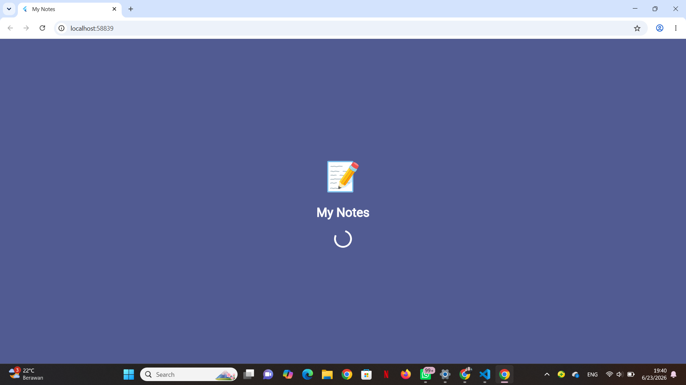

### Halaman Utama
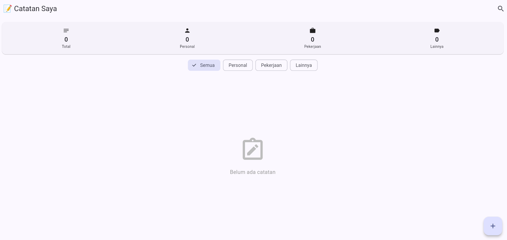

### Drawer
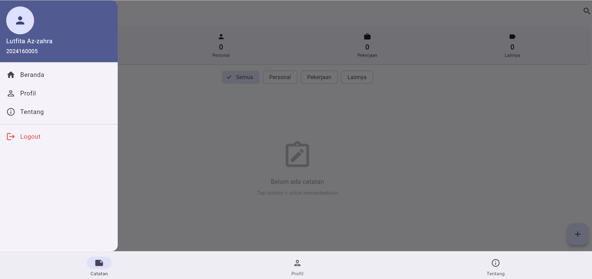

### Tambah Catatan
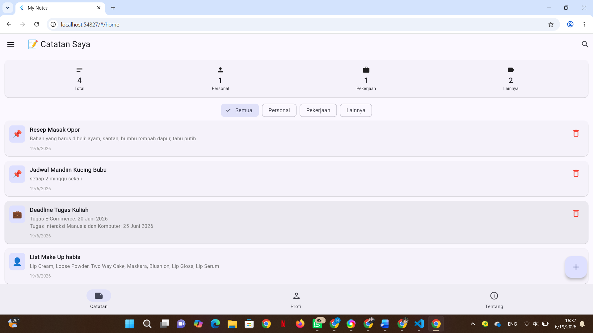

### Hapus Catatan
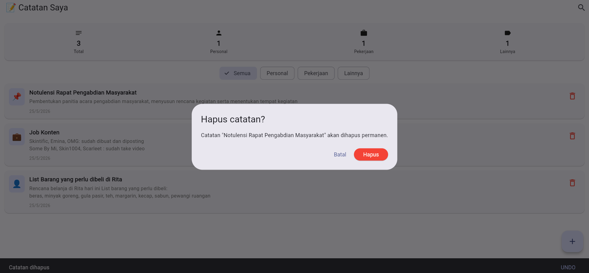

### Halaman Detail
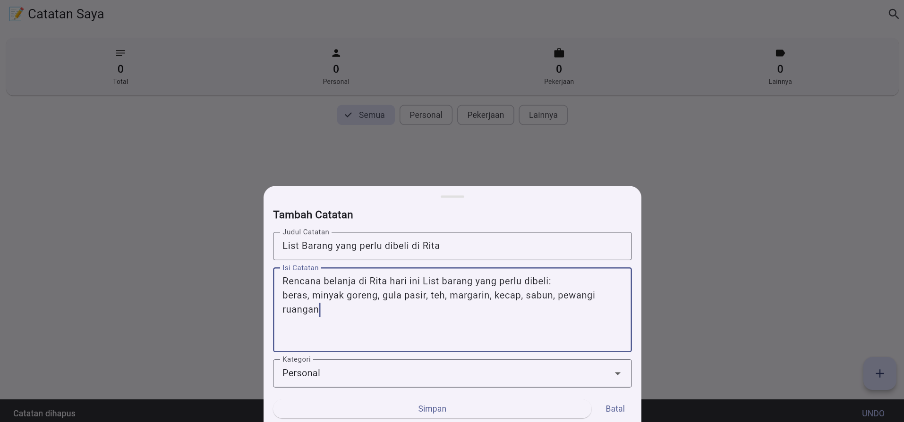

### Halaman Detail 2
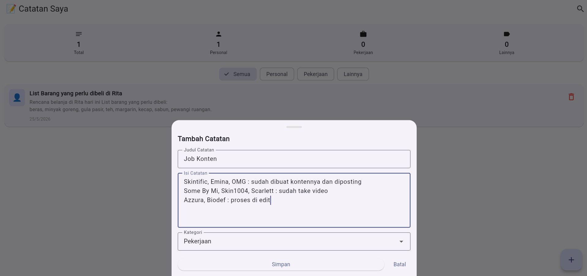

### Halaman Detail 3
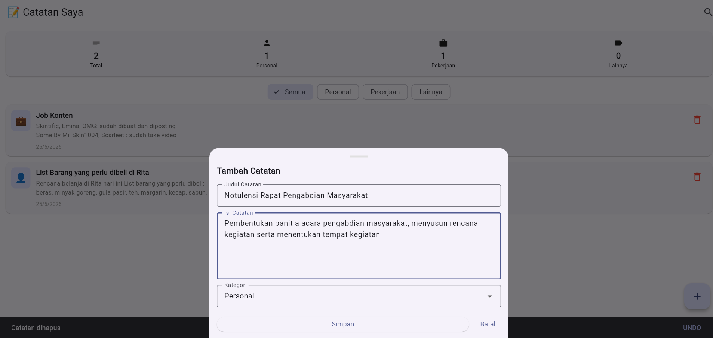

### Search
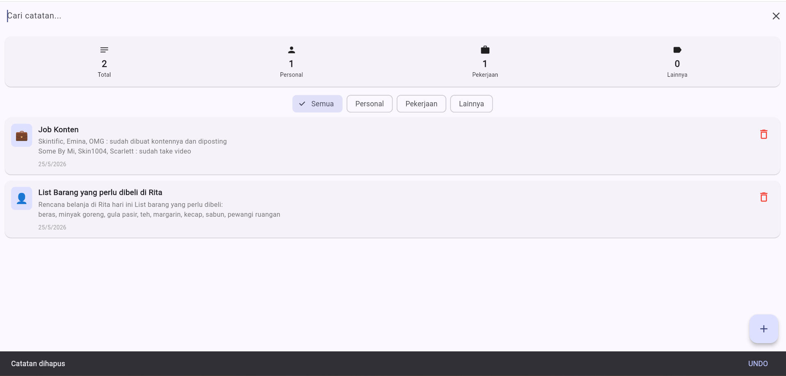

### Profil
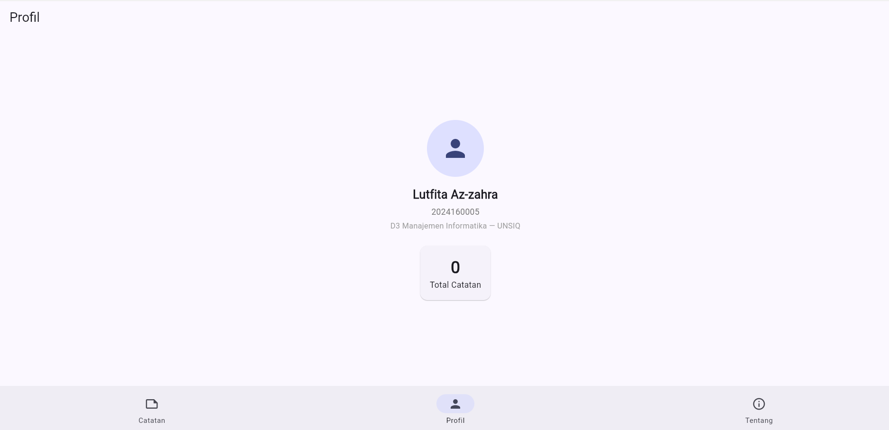

### Tentang
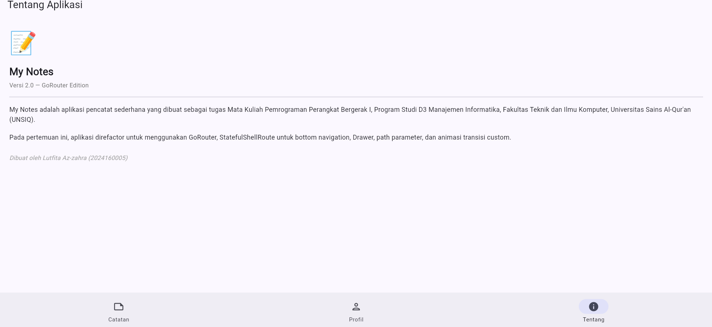

### Add After Delete (AAD)
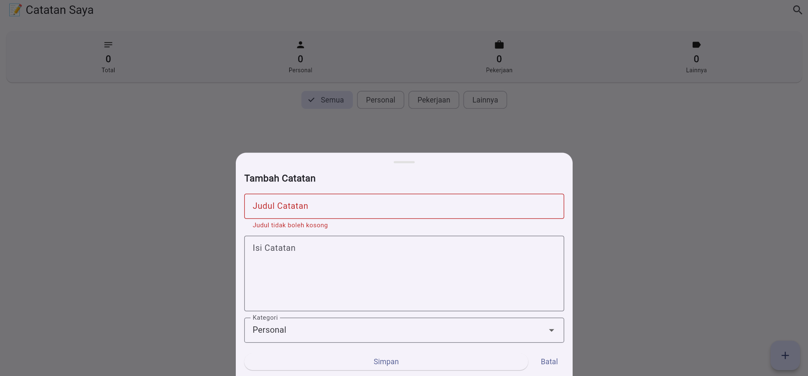